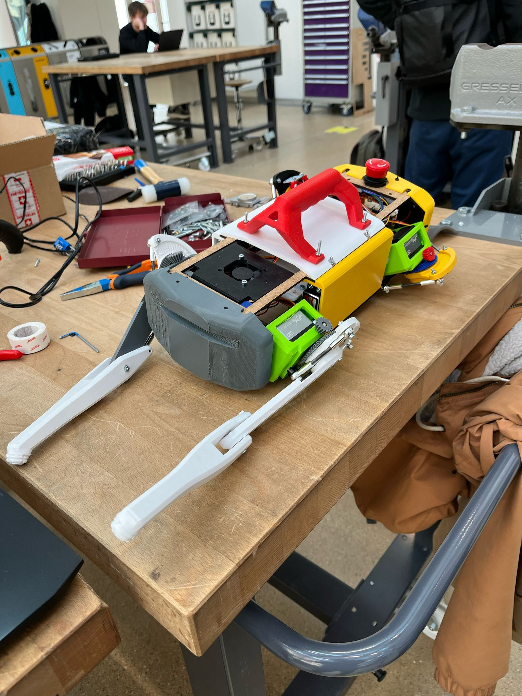

# Portfolio

## In progress projects:

### Robotic's Competition
In a team of 3 and a budget of 2250 CHF, we are tasked with creating a robot that can pick up and unload Legos in an arena. My main task is electronics.

**Keywords: ROS2, Electronics, CAD (Fusion 360), 3D Printing, Laser cutting, Machine Learning, Computer Vision, Machining, Raspberry Pi, Arduino**

<video controls src="Assets/RoboticsCompetition.mp4" title="Title"></video>

### BARK Robot dog (EPFL AI TEAM)
Create a robot dog based on the [DINGO Robot dog](https://github.com/Yerbert/DingoQuadruped). The dog will then be programmed to do tricks using reinforcement learning. My main task is in mechatronics.

**Keywords: ROS, Electronics, CAD (Fusion 360), 3D Printing,**

## Completed Projects

### Small mobile robot with IR sensor (Robopoly)

Designed, built, wired and programmed a small mobile robot in the robotic's makerspace at EPFL. It was a great learning experience in electronics.

**Keywords: Electronics, CAD, Arduino**

<video controls src="Assets/Robopoly.mp4" title="Title"></video>

### Autonomous drone navigation
In a team of 5 programmed a small drone to navigate autonomously through a maze with obstacles, land on a landing pad and fly back to its initial position. My main task was to design the main Finite State Machine

**Keywords: Programing, FSM, Dijkstra, Cost Map**
<video controls src="Assets/drone.mp4" title="Title"></video>
### Accelerometer and VGA for FPGA
Developped an interface for the VGA and accelerometer on the DE10-Lite FPGA board. The results of the project are now used in the Digital Logic class at EPFL.

**Keywords: VHDL, SPI, VGA, Digital Logic**
<video controls src="Assets/vhdl.mp4" title="Title"></video>

### Autonomous Mobile Robot
Programmed in a team of 4 a robot to avoid obstacles and navigate to a goal. The robot had to be able to localize itself after being moved and even if the camera is blocked. I was responsible of Localization and Computer Vision

**Keywords: Kalman Filter, Dijkstra, Computer Vision**

<video controls src="Assets/Thymio.mp4" title="Title"></video>

### VR Game
In a team of 4, created a VR Game with Haptic Feedback in Unity for the Oculus Quest 2. 

**Keywords: Unity, C sharp, Haptics**
<video controls src="Assets/VR.mp4" title="Title"></video>

### Applied Data Anaysis movies project
Analyzed American movies and what percentage of the revenue comes from the foreign market and what percentage comes from the domestic market

Link to the website : https://epfl-ada.github.io/ada-2024-project-thelordsofdata/

**Keywords: Data Analysis, OLS regression, Exploratory Data Analysis, Machine Learning**

